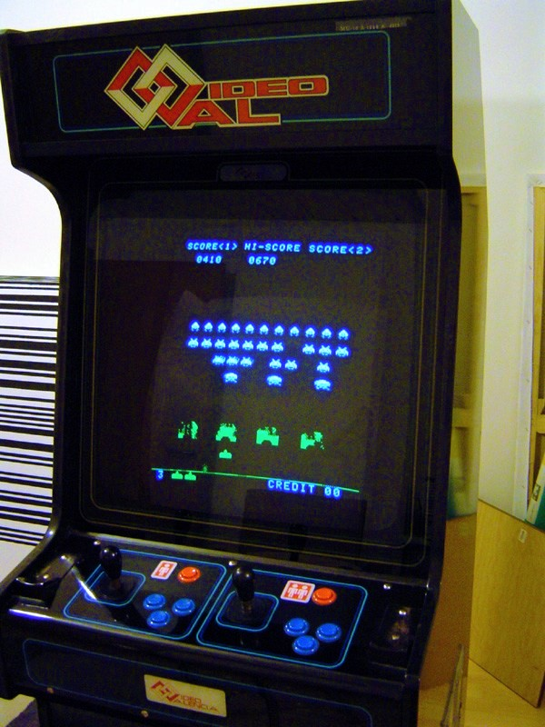

```
This README document is written in Polish language according to hackathon requirments. 
This tutorial would be used in High School, and it's goal is to be as simple to understand
as it is possible. 

If you have any specific question about code please create an issue.
```

# Wstęp
### Space Invaders (Najeźdźcy z Kosmosu)

Space Invaders jest grą shoot 'em up typu fixed shooter, tj. cała plansza widoczna jest przez cały czas na ekranie. Gracz kontroluje działko, przemieszczając je na dole ekranu i strzelając do kosmitów. Celem jest zniszczenie pięciu rzędów kosmitów, po jedenaście przeciwników w każdym (w niektórych wersjach liczby te mogą się różnić), które poruszają się poziomo tam i z powrotem oraz opadają na dół ekranu. Gracz pokonuje kosmitę, zyskując przy tym pewną liczbę punktów, zestrzeliwując go z działka. Im więcej kosmitów gracz zniszczył, tym szybsze są ich ruchy oraz muzyka gry. Pokonanie jednej fali kosmitów powoduje nadejście kolejnej, trudniejszej – cykl ten może trwać w nieskończoność.

Kosmici starają się zniszczyć działko, strzelając w nie. Jednocześnie zbliżają się ku dołowi planszy. Gdy tam dotrą, oznacza to, że ich inwazja się powiodła, a gra się kończy. Specjalny „tajemniczy statek” czasami przemieszcza się u góry ekranu – za jego zniszczenie gracz otrzymuje dodatkowe punkty. Działko chronione jest przez kilka stacjonarnych stanowisk obronnych (ich liczba zależy od wersji gry), które są stopniowo niszczone przez wrogi ostrzał.

Treść zaczerpnięta z wikipedi: [Space Invaders](https://pl.wikipedia.org/wiki/Space_Invaders), gdzie możecie poczytać na 
temat tej klasycznej gry nieco więcej.

Poniżej możecie zobaczyć jak wyglądała oryginalna wersja gry: 



## Organizacja Tutoriala

Niniejszy kurs podzielony został na lekcje. Każda z lekcji pomoże Ci zrozumieć kolejne aspekty programowania obiektowego, oraz silnika _libgdx_. Naszym królikiem doświadczalnym
będzie nasza, odpowiednio uproszczona, interpretacja oryginalnej gry Space Invaders.

* Lekcja 0 - Szablon i struktura projektu
* Lekcja 1 - Dziedziczenie i polimorfizm
  * TextureRegion - Animacje
* Lekcja 2 - Enkupsulacja i interfejsy
  * BitmapFont
  * Rectangle
  * TimeUtils
  * Screen
* Lekcja 2 - Wzorce projektowe

Poszczególne lekcje z wyjątkiem Lekcji 0 - będą znajdowały się na odpowiednich branchach.  
tj. `lesson1-tutorial`, `lesson2-tutorial` i `lesson3-tutorial`.

Oczywiście niniejsza implementacja gry jest niemal kompletna, z uwagi na ograniczony czas trwania zajęć. 
Nic jednak nie stoi na przeszkodzie, żeby w ramach dodatkowych ćwiczeń zapoznać się z 
pozostałymi meandrami projektu, a być może nawet rozbudować o dodatkowe fukcjonalności. 

Jeżeli interesuje Was bardziej rozbudowana wersja gry, albo chcecie rozwijać grę dalej,
zalecam rozpoczęcie przygody od brancha `master`.

# Techniki programowania obiektowego

## Lekcja 0 - Szablon projektu

### Co robimy
Najpierw tytułem wstępu wyjaśnimy Ci co chcemy osiągnąć naszym kursem.
Będziemy ćwiczyć programowanie, poprzez implementacje klasyki gier komputerowych: Space Invaders.

Reguły jakie chcemy spełnić:
1. Wrogowie znajdują się w trzech rzędach na środku ekranu
2. Statek znajduje się na dole ekranu
3. Statek porusza się w lewo i prawo w płaszyźnie ziemi (należy odpowiednio dotknąc lewej lub prawej strony ekranu)
4. Statek może strzelać do kosmitów (przez dotknięcie powyżej środka ekranu)
5. Kosmici strzelają w stronę ziemi
6. Za każdym razem kiedy gracz nie trafia w kosmitę - traci punkty
7. Gdy gracz trafi w kosmitę dostaje punkty dodatnie
8. Kiedy kosmita trafi w gracza, ten przegrywa

Po uruchomieniu gra powinna zaprezentować się w pełnej okazałości: 


### Struktura projektu:

```
|_ core
|_ android
|_ desktop
```

android - moduł zawiera małą aplikacje, która uruchamia naszą grę napisaną w libGDX

desktop - moduł zawiera równie małą aplikację, która uruchamia naszą gre napisaną w libGDX

core - to jest najważniejszy moduł wszystkie zmiany będziemy wprowadzać w tym module, jest to serce naszej implementacji

### Komponenty

* pakiet _root_: `SpaceInvaders` jest główną klasą gry i rozszerza klasę `Game` z silnika _libgdx_, służy
nam jako punkt wejścia dla logiki gry jak i do zarządzania ekranami.
* pakiet `screens` zawiera implementację poszczególnych ekranów gry
* pakiet `manager` składa się z klas, które pozwalają nam zarządzać postaciami, strzałami i elementami graficznymi gry
* pakiet `entity` zawiera wszystkie postaci w grze: strzały, statki wrogów, które tworzą inwazje oraz statek gracza.
* pakiet `ui` zbiera nam wszystkie wizualne komponenty takie jak licznik punktów czy też strowanie gracza.

Poniżej możecie zobaczyć jakie zależności pomiędzy komponentami warto wyróżnić:


## Lekcja 1 - Dziedziczenie i polimorfizm

Proszę przełączcie się na branch: `lesson1-tutorial`

Temat poświęcony dziedziczeniu rozpoczniemy od prostego przykładu, który być może niektórzy z Was 
widzieli już wielokrotnie w różnego rodzaju publikacjach poświęconych językom obiektowym jakim bez 
wątpienia jest język Java. 
Zanim jednak zajmiemy się przykładem zapoznajmy się z encyklopedyczną definicją:

    Dziedziczenie (ang. inheritance) – mechanizm współdzielenia funkcjonalności między klasami. 
    Klasa może dziedziczyć po innej klasie, co oznacza, że oprócz swoich własnych atrybutów oraz zachowań, 
    uzyskuje także te pochodzące z klasy, z której dziedziczy.

Dlaczego chcielibyście współdzielić funkjonalności pomiędzy klasami? 
Odpowiedź jest prosta, żeby powtarzające się, wspólne zachowania dla różnych klas były implementowane 
tylko jeden raz. Jak mogą Was niektórzy autorzy przekonywać, wcale nie chodzi tutaj o lenistwo programistów. 
Pozwolę tu sobie na jeszczę jedną mądrość ludową

    Kod, który z całą pewnością nie zawiera błędów to ten kod, który nie istnieje.
    
Już z spieszę z wyjaśnieniem, otóż pisząć jakąś funkjonalność 2, 3 a może i więcej razy, łatwo jest 
popełnić, w jednej z implementacji błąd. Zatem jeżeli możemy uniknąć powtarzania takiego samego 
kodu możemy uniknąć niepotrzebnych błędów. No ale przecież używam copy-paste, móglibyście odpowiedzić,
wtedy nie zrobię żadnej literówki. Tak zgadza się, ale co jeżeli ta kod, który skopiowaliście do 5, 
może 20 różynych klas zawiera błąd? Już nie jest to takie oczywiste jak to poprawić i nie wprowadzić
dodatkowych błędów, copy-paste już nie pomoże. Dlatego właśnie języki obiektowe zyskały tak ogromną 
popularność, poprzez koncept dziedziczenia pozwalaja unikać zbędnych powtórzeń. W ogólności powyższe
zagadnienie opisuje zasadę DRY (Don't repeat yourself). 

Dobrze, więc wyjaśniwszy sobie sens dziedziczenia, przejdźmy do naszego sztampowego przykładu - zwierzątek. 
Wyobraźmy sobie zwierzę (_Animal_), zwierzę może być scharakteryzowane w jakiś sposób, weźmy na ten 
przykład wielkość, a właściwie bardzej precyzyjnie to jego masę, mięcho w sensie. 

```java
class Animal{
    int weight; //in kilograms
}
```

To jeżeli już mamy materialne zwierzę w jakiś tam sposób scharakteryzowane, to co takie zwierze robi? 
No jeżeli oglądaliście Shreka to takie zwierze może gadać! 

```java
class Animal{
    int weight; 
    
    String noise(){
        return "Ja latam, gadam, pełny serwis!!!";
    }
}
```

No dobrze więc jak już pewnie wiecie z poprzednich lekcji to taką klasę jak powyżej to możemy sobie
i zmaterializować, w sensie zrobić sobie obiekt tej klasy i zapisać jego referencję do zmiennej,
następnie możemy temu zwierzakowi udzielić głosu i wywołać metodę `noise()`.

```java
Animal animal = new Animal();
String noise = animal.noise();
System.out.println(noise);

//: Ja latam, gadam, pełny serwis!!!
```

No dobra nic odkrywczego, czekajcie. Nadal nie wiemy co to za zwierzę jest, pewnie się domyślacie:

```java
class Donkey{
    int mass;
    
    void noise(){
        System.out.println("Daleko jeszcze?! Iooo Iooo");
    }
}
```

no dobra to sprawdźmy naszego osła:

```java
Donkey donkey = new Donkey();
donkey.noise();

//: Daleko jeszcze?! Iooo Iooo
```

Super! Dobra to to jak mamy jakieś zwierzę i mamy osła to może tak zamkniemy je w jednej głośnej zagrodzie i posluchajmy co sie stanie:

```java
List farm = new ArrayList(); 
farm.add(animal);
farm.add(donkey);

for(Object o: farm){
    String noise = o.noise();
    System.out.println(noise);
}

// jshell> for(Object a : farm){
//    ...> a.noise();
//    ...> }
// |  Error:
// |  cannot find symbol
// |    symbol:   method noise()
// |  a.noise();
// |  ^-----^
```

Co sie stalo, otoz wpusicilem Was drodzy czytelnicy w maliny.
Zwroccie prosze uwage na roznice implementacyjne klasy `Animal` i `Donkey`. Nasza intencja 
bylo, ze osiol to tez zwierze. Tylko skad ten biedny kompilator ma to wiedziec? 
Jak to mozemy naprawic? 
Mozemy np. zmienic nazwe metody `noise()` na `toString()` i je ujednolicic. 

```java
class Animal{
    int weight; 
    
    String toString(){
        return "Ja latam, gadam, pełny serwis!!!";
    }
}

class Donkey{
    int mass;
    
    void toString(){
        return "Daleko jeszcze?! Iooo Iooo";
    }
}

List farm = new ArrayList(); 
farm.add(new Animal());
farm.add(new Donkey());

for(Object o: farm){
    System.out.println(o.toString());
}

// Ja latam, gadam, pelny serwis!!!
// Daleko jeszcze?! Iooo Iooo
```

No dobrze ale to jest obejscie dla mieczakow, zwroccie uwage, ze wykorzystuje wlasciwosc klasy 
`Object` zarowno w przypadku petli `for`, jak i samej listy czyli naszej farmy. 
`List farm` w tym momencie przechowuje elementy typu `Object`. Niemozliwe dlatego bylo wywolanie
na obiektach farmy, czyli zwierzetach metody `noise()`. Obiekt `Object` takiej metody nie 
zawiera. 
W powyzszym przykladzie wykorzystalismy tzw. _przeslanianie_ czyli jedna z wlasciwosci 
_polimorfizmu_, o ktorym dowiecie sie w dalszej czesci tutorialu. 

Co to ma wszystko wspolnego z 
dziedziczeniem? Do rzeczy chlopie! 
Kazda klasa w jezyku Java dziedziczy po klasie `Object`! Tak! Wykorzystaliscie wlasnie 
polimorfizm czyli jedna z cech programowania obiektowego, ktory nierozlaczny jest z konceptem dziedziczenia. Metoda `toString()` z klasy `Object` zostala przeslonieta Wasza implementacja.

Dobrze wiec jak sie robi to dziedziczenie? Bardzo prosto, bedziemy potrzebowali slowa kluczowego
`extends` czyli mowimy, ze Osiol rozszerza Zwierze: `Donkey extends Animal`.

```java
class Animal{
    int weight; 
    
    String noise(){
        return "Ja latam, gadam, pełny serwis!!!";
    }
}

class Donkey extends Animal{
    int mass;
    
    @Override
    String noise(){
        return "Daleko jeszcze?! Iooo Iooo";
    }
}
```

Skoro juz wiecie, ze jest cos takiego jak polimorfizm, to wprowadzmy odrazu podpowiedz,
dla kompilatora, ktora jawnie przypomni i jemu i Wam, ze metoda `noise()` jest przeslaniana. 
Do tego sluzy slowko - anotacja - `@Override` czyli nadpisz. 
Teraz juz jawnie widzimy, ze `Donkey` rozszerza klase `Animal`. Mozemy traktowac obiekt
klasy `Donkey` tak samo jak `Animal`, gdyz Osiol to zwierze. Tak wiec mozemy zebrac zwierzaki
do jednej farmy w postaci listy zwierzat. A nastepnie przeiterowac sie po wszystkich
zwierzetach i poprosic je o glos. 
 
```java
//Musimy tym razem podpowiedziec, ze farma przechowuje zwierzeta
List<Animal> farm = new ArrayList<Animal>(); 
farm.add(new Animal());
farm.add(new Donkey());

for(Animal a: farm){
    System.out.println(a.noise());
}
```

Zwroccie uwage na to, ze wewnatrz petli `for` odnosimy sie do zmiennej `a` typu `Animal`.
Jak myslicie jaki bedzie wynik powyzszego kodu? 
```
// Ja latam, gadam, pelny serwis!!!
// Ja latam, gadam, pelny serwis!!!
```

czy

```
// Ja latam, gadam, pelny serwis!!!
// Daleko Jeszcze
```
Ci z Was, ktorzy obstawali wariant drugi oczywiscie mieli racje. Pomimo, ze zmienna o krotkim zasiegu `a` jest typu `Animal` to w rzeczywistosci w drugiej iteracji petli bedzie zawierala
referencje do obiektu klasy `Donkey`.

Wrocmy jeszcze do watku na temat klasy `Object`, przeciez wczesniej nie uzywalismy nigdzie
frazy `extends`. A no, to dlatego, ze w javie nasze klasy dziedzicza op klasie `Object` w sposob nie jawny. Jest to takzwany _syntax sugar_ czyli ulatwienie w skladni jezyka. W tym przypadku poprzez opcjonalne stosowanie `extends Object`, bo nic nie stoi na przeszkodzie, zeby nasza
deklaracja klasy wygladala w taki sposob:

```java
class Animal extends Object{
    int weight; 
    
    String noise(){
        return "Ja latam, gadam, pełny serwis!!!";
    }
}
```

Ale po co wogole to robic, 
napewno nie tylko po to, zeby moc operowac na kolekcjach jaka sa listy. Tylko jak 
na poczatku wspomnialem, zeby unikac powtarzania kodu. Pamietacie? Zasada DRY.

Przyjzyjmy sie naszym zwierzakom, w poszukiwaniu jakis powtorzen. Zwierzak, jest charakteryzowany
poprzez jego wage `int weight`, oraz wydaje z siebie dzwiek - metoda `String noise()`.

O! Nie zauwazyliscie pewnie, ze caly czas zwierze i osiol mialy odrebne charakterystyki.

```java
class Animal{
    int weight; 
    
    String noise(){
        return "Ja latam, gadam, pełny serwis!!!";
    }
}

class Donkey extends Animal{
    int mass;
    
    @Override
    String noise(){
        return "Daleko jeszcze?! Iooo Iooo";
    }
}
```

`int mass` i `int weight`, ponadto to jest to samo, czyli waga! Jak widac, szewc bez butow chodzi. Nie zastosowalem sie do zasady DRY, popelnilem blad, ktory teraz naprawimy. Poprosmy jeszcze zwierzaki, zeby powiedzialy nam ile waza. Zacznijmy tez ustawiac ta wartosc w konstruktorze klasy.

```java
class Animal{
    int weight; 

    public Animal(int weight){
        this.weight = weight;
    }
    
    String noise(){
        return "Ja latam, gadam, pełny serwis!!!";
    }

    int getWeight(){
        return weight;
    }
}

class Donkey extends Animal{ 
    
    public Donkey(int weight){
        super(weight);
    }    
    
    @Override
    String noise(){
        return "Daleko jeszcze?! Iooo Iooo";
    }    
}
```

A co z Oslem? A no to wlasnie cale sedno rozszerzania klas. Osiol z uwagi na to, ze rozszerza klase `Animal` otrzyma takze wszystkie jej funkjonalnosci i charakterystyki. Z wyjatkiem metody 
konstruktora. Pojawil sie w nim dziwny twor `super`, to nie tak, ze waga jest 'super'(wiem cos o tym), ale odwolujemy sie tutaj do konstruktora klasy nadrzednej czyli do konstruktora zwierzaka. 
Unikamy w ten sposob powtorzen. 
Zreszta jezeli sprobujecie o nim zapomniec to kompilator Wam oczywiscie przypomni...
```
Error:
|  constructor Animal in class Animal cannot be applied to given types;
|    required: int
|    found: no arguments
|    reason: actual and formal argument lists differ in length
|  class Donkey extends Animal{
|  ^
|  modified class Donkey, however, it cannot be referenced until this error is corrected: 
|      constructor Animal in class Animal cannot be applied to given types;
|        required: int
|        found: no arguments
|        reason: actual and formal argument lists differ in length
|      class Donkey extends Animal{
|      ^
```

... ale wracajac do przykladu, dodajmy nasze zwierzaki do farmy i zapytajmy o glos i wage:

```java
List<Animal> farm = new ArrayList<>();

farm.add(new Animal(122));
farm.add(new Donkey(144));

for(Animal a: farm){
    System.out.println("Glos: "+ a.noise());
    System.out.println("Waga: "+ a.getWeight());
}

// Glos: Ja latam, gadam, pełny serwis!!!
// Waga: 122
// Glos: Daleko jeszcze?! Iooo Iooo
// Waga: 144

```

Osiol mimo, ze nie zawiera implementacji zwiazanej z waga, bedac zwierzeciem, zawiera wszystkie 
charakterystyki klasy `Animal`.

Rozszerzmy nasz przyklad o nowe zwierzatko i dodajmy je do naszej farmy (czujecie sie jak Noe?)?

```java
class Crow extends Animal{ 
    
    public Crow(int weight){
        super(weight);
    }    
    
    @Override
    String noise(){
        return "Kraa Kraaa!";
    }

    void fly(){
        System.out.println("Flap flap flap!");
    }    
}

Crow crow = new Crow(1);
farm.add(crow);

for(Animal a:farm){
    System.out.println(a.noise());
}

//Ja latam, gadam, pełny serwis!!!
// Daleko jeszcze?! Iooo Iooo
// Kraa Kraaa!

crow.fly();

// Flap flap flap!
```
Nie możliwe jest jednak wywołanie metody `fly()` na obiekcie klasy `Animal` gdyż ta metoda w jej kontekście poprostu nie istnieje. 
Zatem mówimy w takim wypadku, że klasa `Crow` rozszerza klasę `Animal` o metodę `fly()`. Czyli wprowadziliśmy zupełnie nową funkcjonalność, 
do istniejącego wcześniej typu. Zresztą zauważcie proszę, że dokładnie to samo robimy za każdym razem z klasą `Object`. 
Jakie to niesie ze sobą korzyści? A no takie, że może się zdażyć sytuacje w której potrzebujecie dodać nowe zachowanie do jakiejś
klasy np. z biblioteki trzeciej, i jak się pechowo składa, nie macie dostępu do kodu źródłowego. Nic straconego, zawsze możecie rozszeżyć i dodać 
swoje nowe unikalne funkcjonalności.

Nasza hierarchia class w tym momencie prezentuje sie nastepujaco:


### Dla wnikliwych - Klasy Abstrakcyjne

Wnikliwi biolodzy moga zwrocic uwage na pewna niespojnosc w powyzszej koncepcji, a mianowicie co to za zwierze ten caly `Animal`? Nie 
ma takiego zwierzaka, pojecie zwierzecia jest pojeciem abstrakcyjnym.  
No wiec zaskocze was, jezyki obiektowe maja na to rozwiazanie i w elegancki sposob odzwierciedlaja to zjawisko. 

```java
abstract class Animal{
    int weight; 

    public Animal(int weight){
        this.weight = weight;
    }
    
    abstract String noise();

    abstract int getWeight();
}
```
W powyższym przykładzie zastosowaliśmy klasę abstrakcyjną, wskazuje to słowo kluczowe `abstract`. Od tej pory 
nie można już tworzyć instancji klasy `Animal`.  
Jeżeli spróbujecie kompilator poinformuje Was o tym, dlatego nie martwcie się nie zapomnicie.

```java
   jshell> new Animal(2);
    // |  Error:
    // |  Animal is abstract; cannot be instantiated
    // |  new Animal(2);
    // |  ^-----------^
```
No dobrze, w takim razie w jaki sposób powołać do życia instancję zwierzaka? No tylko i wyłącznie poprzez dziedziczenie.
Niejako zmuszamy użytkownika naszej klasy do dziedziczenia. Na następnej lekcji poznacie jeszcze kolejne sposoby, oraz 
zostanie wyjaśnione w jakim celu chcielibyśmy to zastosować. Na chwile obecną skupmy sie na samej mechanice tego rozwiązania.

W załączonym wyżej przykładzie Waszej uwadze napewno nie umknęła specyficzna deklaracja metod. `noise()` i `getWeight()`  
zostały zaimplementowane jako tzw. metody abstrakcyjne, czyli takie, które muszą zostać zaimplementowane przez 
rozszerzająca klasę.  
Zróbmy tak:

```java
class Donkey extends Animal{ 
    
    public Donkey(int weight){
        super(weight);
    }    
    
    @Override
    String noise(){
        return "Daleko jeszcze?! Iooo Iooo";
    }    

    @Override
    int getWeight(){
        return weight;
    }
}
```
Jak widzicie, nadpisałem wszystkie metody abstrakcyjne i podałem ich implementację. Dzięki czemu naszego osła możemy spokojnie traktować 
jako zwierzę a jednocześnie pozbywamy się możliwości tworzenia nijakich instancji klasy `Animal`. Poniższy kod zadziała bez 
najmniejszego problemu.

```java
Animal animal = new Donkey(133);
System.out.println("Waga: "+ animal.getWeight());
System.out.println("Glos: " + animal.noise());

// Waga: 133
// Glos: Daleko jeszcze?! Iooo Iooo
```
No dobrze, a czy możemy pominąć jakąś metodę abstrakcyjną i nie podawać jej implementacji?  
Jako prwadziwy fachowiec odpowiem wam, że to zależy (wężykiem). Otóż jeżeli spróbujemy stworzyć klasę `Dog` bez implementacji 
wszystkich metod to kompilator Wam o tym przypomni:

```java
class Dog extends Animal{
   public Dog(int weight){
       super(weight);
   }
}

// |  Error:
// |  Dog is not abstract and does not override abstract method getWeight() in Animal
// |  class Dog extends Animal{
// |  ^------------------------...

```

Jednak jeżeli przeczytacie uważnie komunikat to w sumie, jest to możliwe. Implikuje to jednak koniczność, żeby Wasza klasa również była `abstract`. Czyli i tak przed implementacja nie uciekniecie. 

```java
abstract class Dog extends Animal{
   public Dog(int weight){
       super(weight);
   }
}
```

Kiedy nam się przydzą te informacje, tak w ramach _spoiler'a_ do enkapsulacji, ale też w przypadku unikania powtórzeń. Generalnie gdy 
przyjdzie Wam zaprojektować jakieś API (Application Programming Interface). W tajemnicy powiem, że nastąpi to znacznie szybciej niż sobie 
wyobrażacie.  
Tak naprawdę każda klasa ma API do funkjonalności, które sama implementuje. Pakiet ma API do komponentu, który stanowi itd.  
No ale mniejsza z tym. Mam nadzieję, że już nie będziecie zaskoczeni metodami bez implementacji albo klasami, których nie da sie zinstancjonować. 

### Dla wnikliwych - Klasy finalne

Jeżeli nie chcemy pozwolić na modyfikowanie (rozszerzanie) naszej klasy to możemy zaznaczyć ten fakt poprzez dopisanie 
modyfikatora `final`.  

```java
    final class Mule extends Animal{
        public Mule(int weight){
            super(weight);
        }    
        
        @Override
        String noise(){
            //Dla bardzo, bardzo wnikliwych: https://www.youtube.com/watch?v=5fWOFFETdK4
            return "Yyyyyyyyyyyeeeee!!!";
        }    

        @Override
        int getWeight(){
            return weight;
        }
    }
```

Jeżeli teraz spróbujecie rozszerzyć taką klasę: 

```java
class MuleWithArmor extends Mule{
    public MuleWithArmor(int weight){
            super(weight);
        }    
}

//The type MuleWithArmor cannot subclass the final class Mule
```
to kompilator Wam na to z całą stanowczością nie pozwoli. 

Podbnie można postąpić z pojedyńczymi metodami:

```java
class Snail extends Animal{
    public Snail(int weight){
        super(weight);
    }

    @Override
    String noise(){
        //Dla bardzo, bardzo wnikliwych: https://www.youtube.com/watch?v=5fWOFFETdK4
        return "____........";
    }    

    @Override
    int getWeight(){
        return weight;
    }

    final String getHome(){
        return "@";
    }
}

Snail snail = new Snail(1);

System.out.println(snail.getHome());
// @
```

Jeżeli spróbujecie nadpisać metodę domku slimaka, to nie uda Wam się to.

```java
class SnailHomeExploit extends Snail{
    public SnailHomeExploit(int weight){
        super(weight);
    }

    @Override
    String getHome(){
        // jakies 2 krzeselka, w srodku stolik i po prawej lozeczko :)
        return "(  # --- #  __ )";
    }
}
// |  Error:
// |  getHome() in SnailHomeExploit cannot override getHome() in Snail
// |    overridden method is final
// |      @Override
// |      ^--------...
```

Dzięki zastosowaniu `final` w połączniu z dziedziczeniem, możecie chronić swój kod przed zmianami. 
Może to się przydać np. w przypadku metod obsługujących płatności czy też inne zabezpieczenia. 

### Podsumowanie

Podsumowujac czego sie nauczylismy do tej pory? 

* Dziedziczenie pozwala na redukcje powtarzajacego sie kodu. Poniewaz klasa dziedziczaca dziedziczy zachowania i charakterystyki nadklasy, superklasy lub przodka jak kto woli, mozecie spotkac sie z roznymi okresleniami.
* Klasa dziedziczaca moze wprowadzic, rozszerzyc klase podstawowa o wlasne zachowania
* Dziedziczenie wiaze sie stricte z polimorfizmem i czyli przeslanianiem sie wzajemnym metod klas.
* Wszystkie klasy w javie dziedzicza z klasy `Object` w sposob niejawny
* Klasy abstrakcyjne nie mogą mieć własnych instancji i służą do ich rozszerzania
* Można zablokować dziedziczenie przy pomocy słowa kluczowego `final`

### Zadanie
Jesteś mechanikiem pokładowym, awarii uległ system napędu rakiet typu próżnia-próżnia. Dostosuj oprogramowanie rakiet analogicznie do rakiet wroga.

Sterownik znajdziesz w klasie:

`com.samsung.business.spaceinvaders.entity.PlayerShoot`

## Lekcja 1 - Animacja postaci

Przez postać rozumiemy rakiety, obcych ale także pociski.

W naszym przykładzie wykorzystamy technike stosowaną przez naszych dziadków ;) zwaną Sprite animation. Podejście to polega na przechowywaniu grafiki w plikach typy mapa bitowa, w tym wypadku png. Kolejne klatki są zapisane w tym samym pliku w postaci kolumn i wierszy. Technika ta polega na indeksowaniu i wybieraniu kolejnych sekwencji z pliku.

Nasz plik dla rakiety wyglada w następujący sposób: 


Animacja polega na tym, że przeglądamy nasz "słownik" tekstur, tak to się czasem nazywa przy pomocy 2 zagnieżdżonych pętli.  
Następnie tak zbudowaną listę tekstur wyświetlamy co jakiś stały odcinek czasu, żeby sprawić wrażenie animacji.


W jaki sposob osiągnąć to w _libgdx_? Dość prosto, mimo, że początkowo może wydać się skomplikowane.
Najpierw przygotujmy sobie zmienne i stałe, które będziemy później wykorzystywać:

```java
private static final boolean LOOPED = true; //warto nazywac stale w kodzie, zeby jasne bylo do czego ona sluzy
private static final float delay = 0.025f; // czas pomiędzy kolejnymi klatkami

private Texture texture; // przechowuje cały plik tekstury (słownika tekstur)
private Animation<TextureRegion> animation; // zmienna przechowuje nam wszystkie klatki animacji i pozwala zwrócić kluczową klatkę bazując na czasie od początku
                                            // animacji.
                                            // typ tej zmiennej to tak zwany typ generyczny, możecie poczytać o tym w internecie, albo poprostu skopiować
```
Przyjżyjcie się komentarzom powyżej.  
Kolejną czynnością jest załadowanie słownika tekstur do pamięci, do zmiennej texture.
```java
Texture texture = new Texture(Gdx.files.internal("rakieta.png"));
```
W następnej kolejności chcemy przy pomocy metody statycznej `split` podzielić załadowaną teksturę na 
pojedyńcze klatki. W tym celu obliczamy sobie rozmiar bitmapy (obrazka) klatki poprzez podzielenie jej wielkości przez oczekiwaną 
ilość kolumn i wierszy.  
W tym przykładzie jak wskazuje na to schemat animacji wskazany wcześniej, będą to 4 kolumny po 2 wiersze.  
Wynikiem podziału (`split`) jest 2 wymiarowa tablica typu 'TextureRegion`.

```java
TextureRegion[][] dictionary = TextureRegion.split(texture,
        texture.getWidth()/ 4,
        texture.getHeight()/ 2);
```

`TextureRegion` jest to prostokątna reprezentacja tekstury, której punktem początkowym jest górny lewy narożnik, natomiast punktem końcowym prawy, dolny narożnik.  
Tego typu dwu-wymiarowa tablica stanowi docelowo łatwy w dostępie słownik tekstur, gdzie adres tablicy: `dictionary[0,1]` zawiera dokładnie 2 klatkę.  
Dosyć często takie słowniki służą też do innych celów niż same animacje, np. mogą to być wizerunki broni, albo kolejne ściany sześcianu.  
W naszym przypadku zamiarem jest przechowywanie poszczególnych klatek animacji, dlatego kolejną rzeczą, którą potrzebujemy wykonać jest spłaszczenie naszej dwu-wymiarowej
tablicy tekstur do tablicy jedno-wymiarowej (pozbywamy się jednego wymiaru). Jej rozmiarem jest `8`, czyli tyle ile poszczególnych klatek animacji.

```java        
TextureRegion[] textureFrames = new TextureRegion[8];
int indeks = 0;
for (int i = 0; i < rowFrames; i++){
    for (int j = 0; j < columnFrames; j++){
        textureFrames[indeks++] = dictionary[i][j];
    }
}
```
Aby utworzyć konkretną animację, czyli zestawić klatki z osią czasu, potrzebujemy stworzyć obiekt animation klasy `Animation<TextureRegion>`.  
Poniżej widzimy przykład, którego efektem jest animacja, która automatycznie rozkłada klatki równomiernice co odcinek czasu (`delay`).

```java
Animation animation = new Animation<TextureRegion>(delay, textureFrames);
```

Aby w trakcie rendereowania naszej animacji, otrzymać właściwego _Sprita_ (właściwą klatkę), korzystamy z metody `getKeyFrame(float delta, boolean isLooped)`, która
w pozwala nam zamiast posługiwać się indeksami w tablicy, pobierać właściwą klatkę bazując na czasie `delta` od poprzedniego wywołania metody `render`.  
Dzięki takiemu zabiegowi, niezależnie od czasu faktycznych obliczeń procesora, otrzymamy właściwą klatkę. Ma to szczególne znaczenie w przypadku mocy procesora, która nie
jest wystarczająca dla naszej gry. 

```java
TextureRegion textureRegion = animation.getKeyFrame(animationTime, LOOPED);
```

Tak pozyskaną klatkę możęmy wykorzystać w trakcie renderowania, dla przykłądu:

```java
public void render(SpriteBatch batch, float delta) {
	animationTime += delta; // przesowamy czas o czastke delta, aby pobrac wlasciwa klatke
	TextureRegion textureRegion = animation.getKeyFrame(animationTime, LOOPED);
	batch.draw(textureRegion, position.x, position.y);
}
```

Cały przykład ładowania i wykorzystania tekstur oraz animacji możecie znaleźć w przykłądowej dla tego kursu grze w następujacych klasach:

* com.samsung.business.spaceinvaders.entity.Spaceship - renderowanie przygotowanej klatki
* com.samsung.business.spaceinvaders.manager.GraphicsManager - ładowanie i przygotowywanie animacji

Hierarchia powyższych klas i okolic: 


## Lekcja 2 - Enkapsulacja
Enkapsulacja, inaczej hermetyzacja jest ukrywaniem szczegółów implementacji oraz uniemożliwieniem zmiany
stanu obiektu przez inne klasy. Gwarantuje nam, że jedynym obiektem odpowiedzialnym za zmianę stanu jest sam obiekt
i nie ma możliwości modyfikacji jego stanu z zewnątrz. 

Analogia z życia:

Idziemy do apteki, chcemy kupić jakiś lek — nie bierzemy go z półki sami, tylko wywołujemy określoną
metodę obiektu Apteka, prosząc Panią Sprzedawczynię, aby ten lek nam podała. Nie interesuje nas w jaki
sposób ona to zrealizuje — tzn czy będzie np. musiała poczukać go w magazynie, czy też wejść na 
stołek bo lek stoi na górnej półce. My tego sami robić nie musimy, to już nie nasz problem, leży to
w gestii drugiego obiektu. Więcej my sami nawet nie wiemy gdzie szukać danego medykamentu i nas to nie
powinno interesować - jest to szczegół implementacyjny klasy Apteka.

Jednym z oczywistych sposobów częściowego uzyskania takiego zachowania jest stosowanie 
modyfikatorow dostępu jak najniższego poziomu, tzn. zaczynamy pisać kod tak, że
wszystkie pola i metody sa private i dokonujemy ich modyfikacji dopiero gdy planujemy użyć 
danego pola/metody w innym miejscu. Niestety jest to tylko puntk wyjscia dla poprawnie enkapsulowanej klasy, 
ponieważ istnieje możliwość, że z jakiegoś powodu chcemy udostępnić stan obiektu, który to może zostać
zmodyfikowany. Przykład takiej niepoprawnej enkapsulacji możemy znaleźć w listingu klasy
`Shoot` z naszego projektu poniżej:

```java
public abstract class Shoot {
    protected Rectangle position;
    
    protected GraphicsManager.Graphics graphics;
    

    public Shoot(GraphicsManager.Graphics graphics, float originX, float originY) {
        this.graphics = graphics;
        position = new Rectangle();
        position.x = originX;
        position.y = originY;
        position.height = 10;
        position.width = 10;
    }
    


    public abstract boolean isOutsideScreen();

    public abstract void updateState();
    

    public void render(SpriteBatch batch, float animationTime) {
        TextureRegion shotFrame = graphics.frameToRender(animationTime);
        batch.draw(shotFrame, position.x, position.y);
    }
    

    public Rectangle position(){
        return position;
    }
    
}
```


##### Zadanie - zidentyfikować i poprawić błąd związany z enkapsulacją.


### Interfejsy

Interfejs jest zbiorem metod wyznaczających pewną, powiązaną ze sobą funkcjonalność. Do javy 8 był to 
tylko zbiór nagłówków metod, bez implementacji, przykłądem nieche będzie `Screen` z libgdx:

```java
/** <p>
 * Represents one of many application screens, such as a main menu, a settings menu, the game screen and so on.
 * </p>
 * <p>
 * Note that {@link #dispose()} is not called automatically.
 * </p>
 * @see Game */
public interface Screen {
	
	/** Called when this screen becomes the current screen for a {@link Game}. */
	public void show ();
	
	/** Called when the screen should render itself.
	 * @param delta The time in seconds since the last render. */
	public void render (float delta);
	

	/** @see ApplicationListener#resize(int, int) */
	public void resize (int width, int height);
	

	/** @see ApplicationListener#pause() */
	public void pause ();
	

	/** @see ApplicationListener#resume() */
	public void resume ();
	

	/** Called when this screen is no longer the current screen for a {@link Game}. */
	public void hide ();
	

	/** Called when this screen should release all resources. */
	public void dispose ();
	
}
```

Od javy 8 interfejsy mogą mieć domyslną implementację metod:
```java
public interface A {
    default void foo(){
       System.out.println("Calling A.foo()");
    }
}
```

Jeśli klasa implementuje interfejs musi ona zapewnić implementację każdej metody w nim zawartej 
(wyjątkiem jest klasa abstrakcyjna). Każda klasa może implementować dowolną liczbę interfejsów. Jest 
to jedna z głównych różnic między klasą abstrakcyjną a interfejsem. Drugą jest ograniczenie, że interfejs
nie może zawierać pól. Interfejsy ułatwiają enkapsulację, w klasie możemy mieć pole będące interfacem,
i posługiwać się nim bez wiedzy jakiej konkretnie klasy faktycznej używamy. Interesuje nas czynność jaką
interfejs umożliwia wykokanie, a nie sama implementacja. Poprawne używanie interfejsów sprawia, żę kod jest
czeytelniejszy i bardizej przejrzysty, oraz posiada mniej zależności pomiędzy klasami.

Dobrym przykładem interfejsu jest ``Screen`` z powyższego listingu. Mamy klasa `Game`, która zarządza 
poszczególnymi ekranami, za pomocą metody ``setScreen()``, dzięki czemu mamy wydzieloną logikę każdego 
ekranu w osobnym miejscu. Natomiast samej klasy ``Game`` nie interesuje implementacja każdego ekranu z osobna.
Jest to szczegół implementacyjny na poziomie pojedynczego ekranu.

##### Zadanie - napisać i podpiąć ekran po wygraniu gry.


### Elementy libgdx


#### TimeUtils

Jest nakładką na pobieranie czasu systemowego. W aplikacji SpaceInvaders jest używany do sprawdzenia czy
gracz lub wróg mogą oddać kolejne strzały. Jako ciekawostkę możecie zwrócić uwagę na różnicę w implementacji
w obu podejsciach:
* PlayerSpaceship - przechowuje informacje o czasie kiedy oddał ostatni strzal(pole `lastShotTime`) i do sprawdzenia
używa fragmentu kodu:

```java
private boolean canShoot() {
    return TimeUtils.nanoTime() - lastShotTime > 600 * 1000 * 1000;
}
```

co w praktyce oznacza, że gracz może strzelać co nieco więcej niż pół sekundy.
* EnemySpaceship - w momencie oddania strzału generuje wartość minimalnego czasu w którym będzie mógł
strzelić ponownie (pole 'nextShotTime') i do sprawdzenia używa warunku:

```java
if (this.canShoot && TimeUtils.nanoTime() > nextShotTime) {
```
gdzie ``this.canShot`  jest flagą, która blokuje strzelanie jeśli wróg nie jest pierwszym widocznym 
w danym rzędzie.

#### Rectangle

Dla przypomnienia punkt (0,0) jest w lewym dolnym rogu. Służy do przechowywania pozycji wszystkich encji w grze.

#### BitmapFont 

Służy do rysowania tekstu. Podstawowe użycie wygląda następująco:

```java
font = new BitmapFont();
font.getData().setScale(3); //mozna skalowac
font.draw(spaceInvaders.batch, "Touch screen to restart", 10, (Gdx.graphics.getHeight()/2)-50);
```
https://github.com/libgdx/libgdx/wiki/Bitmap-fonts do pobrania nardzedzie Hiero do konwertowania czcionek

##### Zadanie - podpiąć własną czcionkę do aplikacji


## Lekcja 3 - Animacja postaci

Przez postać rozumiemy rakiety, obcych ale także pociski.

W naszym przykładzie wykorzystamy technike stosowaną przez naszych dziadków ;) zwaną Sprite animation. Podejście to polega na przechowywaniu grafiki w plikach typy mapa bitowa, w tym wypadku png. Kolejne klatki są zapisane w tym samym pliku w postaci kolumn i wierszy. Technika ta polega na indeksowaniu i wybieraniu kolejnych sekwencji z pliku.


//todo wczytywanie sprite, przyklad

## Lekcja 4 - Poruszanie postacią

## Lekcja 5 - Strzelanie

## Lekcja 6 - Wykrywanie kolizji

## Lekcja 7 -

# Słownik
* Repozytorium - odnosi się do systemów kontroli wersji, w tym wypadku GIT. Repozytorium przypomina bibliotekę z wszystkimi wersjami napisanego programu.
* TAG - znacznik wyróżniający konkretną wersję programu w repozytorium.

# Bibliografia
[1] https://pl.wikipedia.org/wiki/Android_(system_operacyjny)
[2] Android Podręcznik Hackera: Joshua J. Drake, Pau Oliva Fora, Zach Lanier, Collin Mulliner, Stephen A. Ridley, Georg Wicherski
