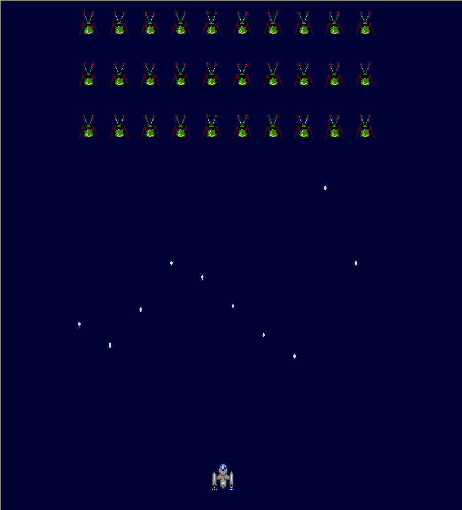

```
This README document is written in Polish language according to hackathon requirments. 
This tutorial would be used in High School, and it's goal is to be as simple to understand
as it is possible. 

If you have any specific question about code please create an issue.
```

# Wstęp
### Space Invaders (Najeźdźcy z Kosmosu)

(Tu opis plus screeny space invaders)



## Organizacja Tutoriala

Niniejszy kurs podzielony został na lekcje. Każda z lekcji pomoże Ci zrozumieć kolejne aspekty programowania.

* Lekcja 0 - Szablon i struktura projektu
* Lekcja 1 - Dziedziczenie i polimorfizm
  * TextureRegion - Animacje
* Lekcja 2 - Enkupsulacja i interfejsy
  * BitmapFont
  * Rectangle
  * TimeUtils
  * Screen
* Lekcja 2 - Wzorce projektowe

# Techniki programowania obiektowego

## Lekcja 0 - Szablon projektu

### Co robimy
Najpierw tytułem wstępu wyjaśnimy Ci co chcemy osiągnąć naszym kursem.
Będziemy ćwiczyć programowanie, poprzez implementacje klasyki gier komputerowych: Space Invaders.

Reguły jakie chcemy spełnić:
1. Wrogowie znajdują się w trzech rzędach na środku ekranu
2. Statek znajduje się na dole ekranu
3. Statek porusza się w lewo i prawo w płaszyźnie ziemi ( pojawia się w miejscu dotknięcia, lub można go przeciągać)
4. Statek może strzelać do kosmitów (przez dotknięcie powyżej 1/3 ekranu)
5. Kosmici strzelają w stronę ziemi

### Struktura projektu:

```
|_ core
|_ android
|_ desktop
```

android - moduł zawiera małą aplikacje, która uruchamia naszą grę napisaną w libGDX

desktop - moduł zawiera równie małą aplikację, która uruchamia naszą gre napisaną w libGDX

core - to jest najważniejszy moduł wszystkie zmiany będziemy wprowadzać w tym module, jest to serce naszej implementacji

#### Komponenty


## Lekcja 1 - Dziedziczenie

Temat poświęcony dziedziczeniu rozpoczniemy od prostego przykładu, który być może niektórzy z Was 
widzieli już wielokrotnie w różnego rodzaju publikacjach poświęconych językom obiektowym jakim bez 
wątpienia jest język Java. 
Zanim jednak zajmiemy się przykładem zapoznajmy się z encyklopedyczną definicją:

    Dziedziczenie (ang. inheritance) – mechanizm współdzielenia funkcjonalności między klasami. 
    Klasa może dziedziczyć po innej klasie, co oznacza, że oprócz swoich własnych atrybutów oraz zachowań, 
    uzyskuje także te pochodzące z klasy, z której dziedziczy.

Dlaczego chcielibyście współdzielić funkjonalności pomiędzy klasami? 
Odpowiedź jest prosta, żeby powtarzające się, wspólne zachowania dla różnych klas były implementowane 
tylko jeden raz. Jak mogą Was niektórzy autorzy przekonywać, wcale nie chodzi tutaj o lenistwo programistów. 
Pozwolę tu sobie na jeszczę jedną mądrość ludową

    Kod, który z całą pewnością nie zawiera błędów to ten kod, który nie istnieje.
    
Już z spieszę z wyjaśnieniem, otóż pisząć jakąś funkjonalność 2, 3 a może i więcej razy, łatwo jest 
popełnić, w jednej z implementacji błąd. Zatem jeżeli możemy uniknąć powtarzania takiego samego 
kodu możemy uniknąć niepotrzebnych błędów. No ale przecież używam copy-paste, móglibyście odpowiedzić,
wtedy nie zrobię żadnej literówki. Tak zgadza się, ale co jeżeli ta kod, który skopiowaliście do 5, 
może 20 różynych klas zawiera błąd? Już nie jest to takie oczywiste jak to poprawić i nie wprowadzić
dodatkowych błędów, copy-paste już nie pomoże. Dlatego właśnie języki obiektowe zyskały tak ogromną 
popularność, poprzez koncept dziedziczenia pozwalaja unikać zbędnych powtórzeń. W ogólności powyższe
zagadnienie opisuje zasadę DRY (Don't repeat yourself). 

Dobrze, więc wyjaśniwszy sobie sens dziedziczenia, przejdźmy do naszego sztampowego przykładu - zwierzątek. 
Wyobraźmy sobie zwierzę (_Animal_), zwierzę może być scharakteryzowane w jakiś sposób, weźmy na ten 
przykład wielkość, a właściwie bardzej precyzyjnie to jego masę, mięcho w sensie. 

```java
class Animal{
    int weight; //in kilograms
}
```

To jeżeli już mamy materialne zwierzę w jakiś tam sposób scharakteryzowane, to co takie zwierze robi? 
No jeżeli oglądaliście Shreka to takie zwierze może gadać! 

```java
class Animal{
    int weight; 
    
    String noise(){
        return "Ja latam, gadam, pełny serwis!!!";
    }
}
```

No dobrze więc jak już pewnie wiecie z poprzednich lekcji to taką klasę jak powyżej to możemy sobie
i zmaterializować, w sensie zrobić sobie obiekt tej klasy i zapisać jego referencję do zmiennej,
następnie możemy temu zwierzakowi udzielić głosu i wywołać metodę `noise()`.

```java
Animal animal = new Animal();
String noise = animal.noise();
System.out.println(noise);

//: Ja latam, gadam, pełny serwis!!!
```

No dobra nic odkrywczego, czekajcie. Nadal nie wiemy co to za zwierzę jest, pewnie się domyślacie:

```java
class Donkey{
    int mass;
    
    void noise(){
        System.out.println("Daleko jeszcze?! Iooo Iooo");
    }
}
```

no dobra to sprawdźmy naszego osła:

```java
Donkey donkey = new Donkey();
donkey.noise();

//: Daleko jeszcze?! Iooo Iooo
```

Super! Dobra to to jak mamy jakieś zwierzę i mamy osła to może tak zamkniemy je w jednej głośnej zagrodzie i posluchajmy co sie stanie:

```java
List farm = new ArrayList(); 
farm.add(animal);
farm.add(donkey);

for(Object o: farm){
    String noise = o.noise();
    System.out.println(noise);
}

// jshell> for(Object a : farm){
//    ...> a.noise();
//    ...> }
// |  Error:
// |  cannot find symbol
// |    symbol:   method noise()
// |  a.noise();
// |  ^-----^
```

Co sie stalo, otoz wpusicilem Was drodzy czytelnicy w maliny.
Zwroccie prosze uwage na roznice implementacyjne klasy `Animal` i `Donkey`. Nasza intencja 
bylo, ze osiol to tez zwierze. Tylko skad ten biedny kompilator ma to wiedziec? 
Jak to mozemy naprawic? 
Mozemy np. zmienic nazwe metody `noise()` na `toString()` i je ujednolicic. 

```java
class Animal{
    int weight; 
    
    String toString(){
        return "Ja latam, gadam, pełny serwis!!!";
    }
}

class Donkey{
    int mass;
    
    void toString(){
        return "Daleko jeszcze?! Iooo Iooo";
    }
}

List farm = new ArrayList(); 
farm.add(new Animal());
farm.add(new Donkey());

for(Object o: farm){
    System.out.println(o.toString());
}

// Ja latam, gadam, pelny serwis!!!
// Daleko jeszcze?! Iooo Iooo
```

No dobrze ale to jest obejscie dla mieczakow, zwroccie uwage, ze wykorzystuje wlasciwosc klasy 
`Object` zarowno w przypadku petli `for`, jak i samej listy czyli naszej farmy. 
`List farm` w tym momencie przechowuje elementy typu `Object`. Niemozliwe dlatego bylo wywolanie
na obiektach farmy, czyli zwierzetach metody `noise()`. Obiekt `Object` takiej metody nie 
zawiera. 
W powyzszym przykladzie wykorzystalismy tzw. _przeslanianie_ czyli jedna z wlasciwosci 
_polimorfizmu_, o ktorym dowiecie sie w dalszej czesci tutorialu. 

Co to ma wszystko wspolnego z 
dziedziczeniem? Do rzeczy chlopie! 
Kazda klasa w jezyku Java dziedziczy po klasie `Object`! Tak! Wykorzystaliscie wlasnie 
polimorfizm czyli jedna z cech programowania obiektowego, ktory nierozlaczny jest z konceptem dziedziczenia. Metoda `toString()` z klasy `Object` zostala przeslonieta Wasza implementacja.

Dobrze wiec jak sie robi to dziedziczenie? Bardzo prosto, bedziemy potrzebowali slowa kluczowego
`extends` czyli mowimy, ze Osiol rozszerza Zwierze: `Donkey extends Animal`.

```java
class Animal{
    int weight; 
    
    String noise(){
        return "Ja latam, gadam, pełny serwis!!!";
    }
}

class Donkey extends Animal{
    int mass;
    
    @Override
    String noise(){
        return "Daleko jeszcze?! Iooo Iooo";
    }
}
```

Skoro juz wiecie, ze jest cos takiego jak polimorfizm, to wprowadzmy odrazu podpowiedz,
dla kompilatora, ktora jawnie przypomni i jemu i Wam, ze metoda `noise()` jest przeslaniana. 
Do tego sluzy slowko - anotacja - `@Override` czyli nadpisz. 
Teraz juz jawnie widzimy, ze `Donkey` rozszerza klase `Animal`. Mozemy traktowac obiekt
klasy `Donkey` tak samo jak `Animal`, gdyz Osiol to zwierze. Tak wiec mozemy zebrac zwierzaki
do jednej farmy w postaci listy zwierzat. A nastepnie przeiterowac sie po wszystkich
zwierzetach i poprosic je o glos. 
 
```java
//Musimy tym razem podpowiedziec, ze farma przechowuje zwierzeta
List<Animal> farm = new ArrayList<Animal>(); 
farm.add(new Animal());
farm.add(new Donkey());

for(Animal a: farm){
    System.out.println(a.noise());
}
```

Zwroccie uwage na to, ze wewnatrz petli `for` odnosimy sie do zmiennej `a` typu `Animal`.
Jak myslicie jaki bedzie wynik powyzszego kodu? 
```
// Ja latam, gadam, pelny serwis!!!
// Ja latam, gadam, pelny serwis!!!
```

czy

```
// Ja latam, gadam, pelny serwis!!!
// Daleko Jeszcze
```
Ci z Was, ktorzy obstawali wariant drugi oczywiscie mieli racje. Pomimo, ze zmienna o krotkim zasiegu `a` jest typu `Animal` to w rzeczywistosci w drugiej iteracji petli bedzie zawierala
referencje do obiektu klasy `Donkey`.

Wrocmy jeszcze do watku na temat klasy `Object`, przeciez wczesniej nie uzywalismy nigdzie
frazy `extends`. A no, to dlatego, ze w javie nasze klasy dziedzicza op klasie `Object` w sposob nie jawny. Jest to takzwany _syntax sugar_ czyli ulatwienie w skladni jezyka. W tym przypadku poprzez opcjonalne stosowanie `extends Object`, bo nic nie stoi na przeszkodzie, zeby nasza
deklaracja klasy wygladala w taki sposob:

```java
class Animal extends Object{
    int weight; 
    
    String noise(){
        return "Ja latam, gadam, pełny serwis!!!";
    }
}
```

Ale po co wogole to robic, 
napewno nie tylko po to, zeby moc operowac na kolekcjach jaka sa listy. Tylko jak 
na poczatku wspomnialem, zeby unikac powtarzania kodu. Pamietacie? Zasada DRY.

Przyjzyjmy sie naszym zwierzakom, w poszukiwaniu jakis powtorzen. Zwierzak, jest charakteryzowany
poprzez jego wage `int weight`, oraz wydaje z siebie dzwiek - metoda `String noise()`.

O! Nie zauwazyliscie pewnie, ze caly czas zwierze i osiol mialy odrebne charakterystyki.

```java
class Animal{
    int weight; 
    
    String noise(){
        return "Ja latam, gadam, pełny serwis!!!";
    }
}

class Donkey extends Animal{
    int mass;
    
    @Override
    String noise(){
        return "Daleko jeszcze?! Iooo Iooo";
    }
}
```

`int mass` i `int weight`, ponadto to jest to samo, czyli waga! Jak widac, szewc bez butow chodzi. Nie zastosowalem sie do zasady DRY, popelnilem blad, ktory teraz naprawimy. Poprosmy jeszcze zwierzaki, zeby powiedzialy nam ile waza. Zacznijmy tez ustawiac ta wartosc w konstruktorze klasy.

```java
class Animal{
    int weight; 

    public Animal(int weight){
        this.weight = weight;
    }
    
    String noise(){
        return "Ja latam, gadam, pełny serwis!!!";
    }

    int getWeight(){
        return weight;
    }
}

class Donkey extends Animal{ 
    
    public Donkey(int weight){
        super(weight);
    }    
    
    @Override
    String noise(){
        return "Daleko jeszcze?! Iooo Iooo";
    }    
}
```

A co z Oslem? A no to wlasnie cale sedno rozszerzania klas. Osiol z uwagi na to, ze rozszerza klase `Animal` otrzyma takze wszystkie jej funkjonalnosci i charakterystyki. Z wyjatkiem metody 
konstruktora. Pojawil sie w nim dziwny twor `super`, to nie tak, ze waga jest 'super'(wiem cos o tym), ale odwolujemy sie tutaj do konstruktora klasy nadrzednej czyli do konstruktora zwierzaka. 
Unikamy w ten sposob powtorzen. 
Zreszta jezeli sprobujecie o nim zapomniec to kompilator Wam oczywiscie przypomni...
```
Error:
|  constructor Animal in class Animal cannot be applied to given types;
|    required: int
|    found: no arguments
|    reason: actual and formal argument lists differ in length
|  class Donkey extends Animal{
|  ^
|  modified class Donkey, however, it cannot be referenced until this error is corrected: 
|      constructor Animal in class Animal cannot be applied to given types;
|        required: int
|        found: no arguments
|        reason: actual and formal argument lists differ in length
|      class Donkey extends Animal{
|      ^
```

... ale wracajac do przykladu, dodajmy nasze zwierzaki do farmy i zapytajmy o glos i wage:

```java
List<Animal> farm = new ArrayList<>();

farm.add(new Animal(122));
farm.add(new Donkey(144));

for(Animal a: farm){
    System.out.println("Glos: "+ a.noise());
    System.out.println("Waga: "+ a.getWeight());
}

// Glos: Ja latam, gadam, pełny serwis!!!
// Waga: 122
// Glos: Daleko jeszcze?! Iooo Iooo
// Waga: 144

```

Osiol mimo, ze nie zawiera implementacji zwiazanej z waga, bedac zwierzeciem, zawiera wszystkie 
charakterystyki klasy `Animal`.

Rozszerzmy nasz przyklad o nowe zwierzatko i dodajmy je do naszej farmy (czujecie sie jak Noe?)?

```java
class Crow extends Animal{ 
    
    public Crow(int weight){
        super(weight);
    }    
    
    @Override
    String noise(){
        return "Kraa Kraaa!";
    }

    void fly(){
        System.out.println("Flap flap flap!");
    }    
}

Crow crow = new Crow(1);
farm.add(crow);

for(Animal a:farm){
    System.out.println(a.noise());
}

//Ja latam, gadam, pełny serwis!!!
// Daleko jeszcze?! Iooo Iooo
// Kraa Kraaa!

crow.fly();

// Flap flap flap!
```
Nie możliwe jest jednak wywołanie metody `fly()` na obiekcie klasy `Animal` gdyż ta metoda w jej kontekście poprostu nie istnieje. 
Zatem mówimy w takim wypadku, że klasa `Crow` rozszerza klasę `Animal` o metodę `fly()`. Czyli wprowadziliśmy zupełnie nową funkcjonalność, 
do istniejącego wcześniej typu. Zresztą zauważcie proszę, że dokładnie to samo robimy za każdym razem z klasą `Object`. 
Jakie to niesie ze sobą korzyści? A no takie, że może się zdażyć sytuacje w której potrzebujecie dodać nowe zachowanie do jakiejś
klasy np. z biblioteki trzeciej, i jak się pechowo składa, nie macie dostępu do kodu źródłowego. Nic straconego, zawsze możecie rozszeżyć i dodać 
swoje nowe unikalne funkcjonalności.

Nasza hierarchia class w tym momencie prezentuje sie nastepujaco:


### Dla wnikliwych - Klasy Abstrakcyjne

Wnikliwi biolodzy moga zwrocic uwage na pewna niespojnosc w powyzszej koncepcji, a mianowicie co to za zwierze ten caly `Animal`? Nie 
ma takiego zwierzaka, pojecie zwierzecia jest pojeciem abstrakcyjnym.  
No wiec zaskocze was, jezyki obiektowe maja na to rozwiazanie i w elegancki sposob odzwierciedlaja to zjawisko. 

```java
abstract class Animal{
    int weight; 

    public Animal(int weight){
        this.weight = weight;
    }
    
    abstract String noise();

    abstract int getWeight();
}
```
W powyższym przykładzie zastosowaliśmy klasę abstrakcyjną, wskazuje to słowo kluczowe `abstract`. Od tej pory 
nie można już tworzyć instancji klasy `Animal`.  
Jeżeli spróbujecie kompilator poinformuje Was o tym, dlatego nie martwcie się nie zapomnicie.

```java
   jshell> new Animal(2);
    // |  Error:
    // |  Animal is abstract; cannot be instantiated
    // |  new Animal(2);
    // |  ^-----------^
```
No dobrze, w takim razie w jaki sposób powołać do życia instancję zwierzaka? No tylko i wyłącznie poprzez dziedziczenie.
Niejako zmuszamy użytkownika naszej klasy do dziedziczenia. Na następnej lekcji poznacie jeszcze kolejne sposoby, oraz 
zostanie wyjaśnione w jakim celu chcielibyśmy to zastosować. Na chwile obecną skupmy sie na samej mechanice tego rozwiązania.

W załączonym wyżej przykładzie Waszej uwadze napewno nie umknęła specyficzna deklaracja metod. `noise()` i `getWeight()`  
zostały zaimplementowane jako tzw. metody abstrakcyjne, czyli takie, które muszą zostać zaimplementowane przez 
rozszerzająca klasę.  
Zróbmy tak:

```java
class Donkey extends Animal{ 
    
    public Donkey(int weight){
        super(weight);
    }    
    
    @Override
    String noise(){
        return "Daleko jeszcze?! Iooo Iooo";
    }    

    @Override
    int getWeight(){
        return weight;
    }
}
```
Jak widzicie, nadpisałem wszystkie metody abstrakcyjne i podałem ich implementację. Dzięki czemu naszego osła możemy spokojnie traktować 
jako zwierzę a jednocześnie pozbywamy się możliwości tworzenia nijakich instancji klasy `Animal`. Poniższy kod zadziała bez 
najmniejszego problemu.

```java
Animal animal = new Donkey(133);
System.out.println("Waga: "+ animal.getWeight());
System.out.println("Glos: " + animal.noise());

// Waga: 133
// Glos: Daleko jeszcze?! Iooo Iooo
```
No dobrze, a czy możemy pominąć jakąś metodę abstrakcyjną i nie podawać jej implementacji?  
Jako prwadziwy fachowiec odpowiem wam, że to zależy (wężykiem). Otóż jeżeli spróbujemy stworzyć klasę `Dog` bez implementacji 
wszystkich metod to kompilator Wam o tym przypomni:

```java
class Dog extends Animal{
   public Dog(int weight){
       super(weight);
   }
}

// |  Error:
// |  Dog is not abstract and does not override abstract method getWeight() in Animal
// |  class Dog extends Animal{
// |  ^------------------------...

```

Jednak jeżeli przeczytacie uważnie komunikat to w sumie, jest to możliwe. Implikuje to jednak koniczność, żeby Wasza klasa również była `abstract`. Czyli i tak przed implementacja nie uciekniecie. 

```java
abstract class Dog extends Animal{
   public Dog(int weight){
       super(weight);
   }
}
```

Kiedy nam się przydzą te informacje, tak w ramach _spoiler'a_ do enkapsulacji, ale też w przypadku unikania powtórzeń. Generalnie gdy 
przyjdzie Wam zaprojektować jakieś API (Application Programming Interface). W tajemnicy powiem, że nastąpi to znacznie szybciej niż sobie 
wyobrażacie.  
Tak naprawdę każda klasa ma API do funkjonalności, które sama implementuje. Pakiet ma API do komponentu, który stanowi itd.  
No ale mniejsza z tym. Mam nadzieję, że już nie będziecie zaskoczeni metodami bez implementacji albo klasami, których nie da sie zinstancjonować. 

### Dla wnikliwych - Klasy finalne

Jeżeli nie chcemy pozwolić na modyfikowanie (rozszerzanie) naszej klasy to możemy zaznaczyć ten fakt poprzez dopisanie 
modyfikatora `final`.  

```java
    final class Mule extends Animal{
        public Mule(int weight){
            super(weight);
        }    
        
        @Override
        String noise(){
            //Dla bardzo, bardzo wnikliwych: https://www.youtube.com/watch?v=5fWOFFETdK4
            return "Yyyyyyyyyyyeeeee!!!";
        }    

        @Override
        int getWeight(){
            return weight;
        }
    }
```

Jeżeli teraz spróbujecie rozszerzyć taką klasę: 

```java
class MuleWithArmor extends Mule{
    public MuleWithArmor(int weight){
            super(weight);
        }    
}

//The type MuleWithArmor cannot subclass the final class Mule
```
to kompilator Wam na to z całą stanowczością nie pozwoli. 

Podbnie można postąpić z pojedyńczymi metodami:

```java
class Snail extends Animal{
    public Snail(int weight){
        super(weight);
    }

    @Override
    String noise(){
        //Dla bardzo, bardzo wnikliwych: https://www.youtube.com/watch?v=5fWOFFETdK4
        return "____........";
    }    

    @Override
    int getWeight(){
        return weight;
    }

    final String getHome(){
        return "@";
    }
}

Snail snail = new Snail(1);

System.out.println(snail.getHome());
// @
```

Jeżeli spróbujecie nadpisać metodę domku slimaka, to nie uda Wam się to.

```java
class SnailHomeExploit extends Snail{
    public SnailHomeExploit(int weight){
        super(weight);
    }

    @Override
    String getHome(){
        // jakies 2 krzeselka, w srodku stolik i po prawej lozeczko :)
        return "(  # --- #  __ )";
    }
}
// |  Error:
// |  getHome() in SnailHomeExploit cannot override getHome() in Snail
// |    overridden method is final
// |      @Override
// |      ^--------...
```

Dzięki zastosowaniu `final` w połączniu z dziedziczeniem, możecie chronić swój kod przed zmianami. 
Może to się przydać np. w przypadku metod obsługujących płatności czy też inne zabezpieczenia. 

### Podsumowanie

Podsumowujac czego sie nauczylismy do tej pory? 

* Dziedziczenie pozwala na redukcje powtarzajacego sie kodu. Poniewaz klasa dziedziczaca dziedziczy zachowania i charakterystyki nadklasy, superklasy lub przodka jak kto woli, mozecie spotkac sie z roznymi okresleniami.
* Klasa dziedziczaca moze wprowadzic, rozszerzyc klase podstawowa o wlasne zachowania
* Dziedziczenie wiaze sie stricte z polimorfizmem i czyli przeslanianiem sie wzajemnym metod klas.
* Wszystkie klasy w javie dziedzicza z klasy `Object` w sposob niejawny
* Klasy abstrakcyjne nie mogą mieć własnych instancji i służą do ich rozszerzania
* Można zablokować dziedziczenie przy pomocy słowa kluczowego `final`

### Animacja postaci

Przez postać rozumiemy rakiety, obcych ale także pociski.

W naszym przykładzie wykorzystamy technike stosowaną przez naszych dziadków ;) zwaną Sprite animation. Podejście to polega na przechowywaniu grafiki w plikach typy mapa bitowa, w tym wypadku png. Kolejne klatki są zapisane w tym samym pliku w postaci kolumn i wierszy. Technika ta polega na indeksowaniu i wybieraniu kolejnych sekwencji z pliku.


//todo wczytywanie sprite, przyklad
